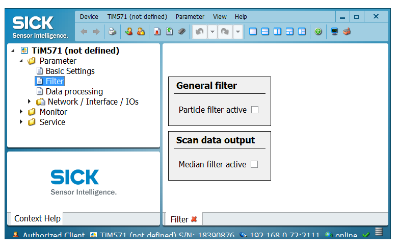

# sick_scan FAQ

## rviz shows a grey point cloud

:question: rviz shows a grey point cloud. The size of points can be adjusted.

:white_check_mark: Check in the launch file that the intensity flag is set to True.

:question: rviz shows a grey point cloud and the size of points can not be adjusted.

:white_check_mark: Probably in this case you are running Linux in a virtual machine. In this case, OpenGL may not work correctly in the VM. rviz then chooses a kind of "fallback solution" and deactivates the colors.
Also, changing the "Size" and "Style" display in rviz has no effect on the display of the pointcloud data.

The problem can be avoided by starting rviz with the following sequence:

```
export LIBGL_ALWAYS_SOFTWARE=1
rosrun rviz rviz
```

## Angular resolution and scan frequency

:question: The angular resolution/ number of shots is too small

:white_check_mark: Possibly Mean or Median filters are activated. Use Sopas ET to deactivate them and store this settings permanent on the device, see picture.

Further information can be found at http://wiki.ros.org/rviz/Troubleshooting.
