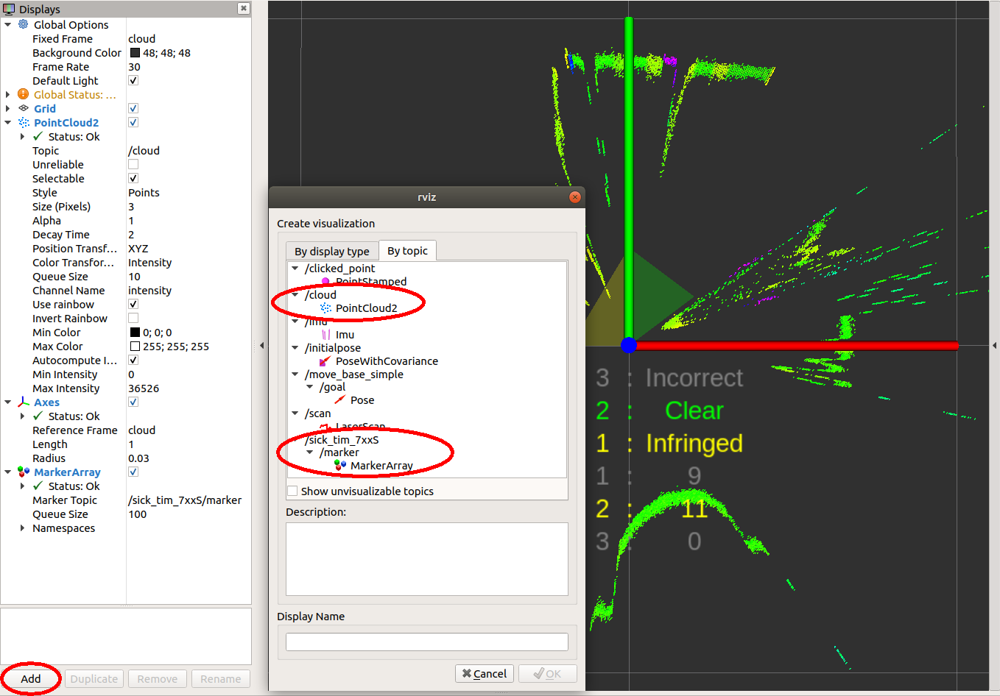
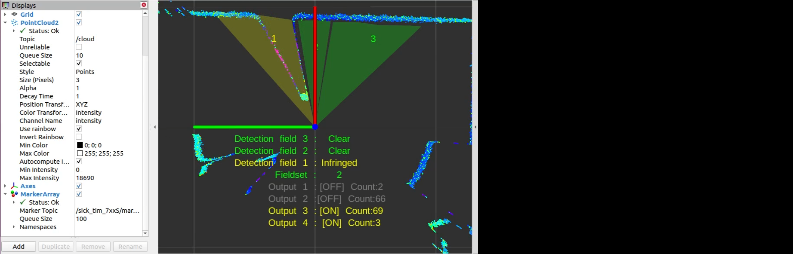
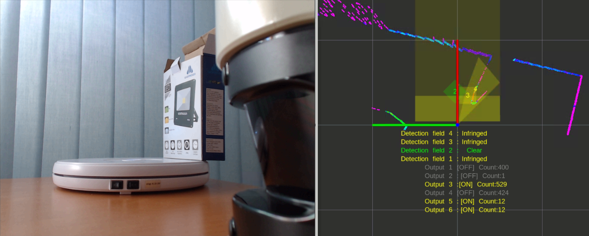

# Field monitoring for LMS1xx, LMS5xx, TiM7xx and TiM7xxS

The LMS1xx, LMS5xx, TiM7xx and TiM7xxS families have the following extended settings for field monitoring:

## Field monitoring messages

LMS1xx, LMS5xx, TiM7xx and TiM7xxS scanner support field monitoring. Fields can be configured by Sopas ET. Once they are configured, sick_scan publishes ros messages containing the monitoring information from the lidar. 

By default, field monitoring is enabled in the launch files [sick_lms_1xx.launch](../launch/sick_lms_1xx.launch),  [sick_lms_5xx.launch](../launch/sick_lms_5xx.launch),
[sick_tim_7xx.launch](../launch/sick_tim_7xx.launch) resp. [sick_tim_7xxS.launch](../launch/sick_tim_7xxS.launch) by following settings:
```
<param name="activate_lferec" type="bool" value="True"/> <!-- activate field monitoring by lferec messages -->
<param name="activate_lidoutputstate" type="bool" value="True"/> <!-- activate field monitoring by lidoutputstate messages -->
<param name="activate_lidinputstate" type="bool" value="True"/> <!-- activate field monitoring by lidinputstate messages -->
```

The driver queries the field configuration from the lidar and activates field monitoring by sending cola commands `"sEN LFErec 1"` and `"sEN LIDoutputstate 1"` at startup. Field monitoring is deactivated when driver exits. During runtime, it's possible to query, activate or deactivate monitoring using ros service ColaMsg with the following command (see section [Cola commands](#cola-commands)):
```
rosservice call /sick_tim_7xx/ColaMsg "{request: 'sEN LFErec 1'}" # activate LFErec messages 
rosservice call /sick_tim_7xx/ColaMsg "{request: 'sEN LFErec 0'}" # deactivate LFErec messages 
rosservice call /sick_tim_7xx/ColaMsg "{request: 'sRN LFErec'}"   # query activation status of LFErec messages 
rosservice call /sick_tim_7xx/ColaMsg "{request: 'sEN LIDoutputstate 1'}" # activate LIDoutputstate messages 
rosservice call /sick_tim_7xx/ColaMsg "{request: 'sEN LIDoutputstate 0'}" # deactivate LIDoutputstate messages 
rosservice call /sick_tim_7xx/ColaMsg "{request: 'sRN LIDoutputstate'}"   # query activation status of LIDoutputstate messages 
rosservice call /sick_tim_7xx/ColaMsg "{request: 'sEN LIDinputstate 1'}"  # activate LIDinputstate messages 
rosservice call /sick_tim_7xx/ColaMsg "{request: 'sEN LIDinputstate 0'}"  # deactivate LIDinputstate messages 
rosservice call /sick_tim_7xx/ColaMsg "{request: 'sRN LIDinputstate'}"    # query activation status of LIDinputstate messages 
```

LFErec and LIDoutputstate messages are defined in [LFErecMsg.msg](../msg/LFErecMsg.msg) and [LFErecFieldMsg.msg](../msg/LFErecFieldMsg.msg) resp. [LIDoutputstateMsg.msg](../msg/LIDoutputstateMsg.msg) and published on the following topics: `"/sick_tim_7xxS/lferec"` resp. `"/sick_tim_7xxS/lidoutputstate"`.

| ** Scanner ** | ** lferec topic ** | ** lidoutputstate topic **  |
|---------------|--------------------|-----------------------------|
| lms_1xx  | /sick_lms_1xx/lferec  | /sick_lms_1xx/lidoutputstate  |
| lms_5xx  | /sick_lms_5xx/lferec  | /sick_lms_5xx/lidoutputstate  |
| lms_7xx  | /sick_tim_7xx/lferec  | /sick_tim_7xx/lidoutputstate  |
| lms_7xxS | /sick_tim_7xxS/lferec | /sick_tim_7xxS/lidoutputstate |

To view the field monitoring messages, run
```
rostopic echo "/sick_lms_1xx/lferec"
rostopic echo "/sick_lms_1xx/lidoutputstate"
rostopic echo "/sick_lms_5xx/lferec"
rostopic echo "/sick_lms_5xx/lidoutputstate"
rostopic echo "/sick_tim_7xx/lferec"
rostopic echo "/sick_tim_7xx/lidoutputstate"
rostopic echo "/sick_tim_7xxS/lferec"
rostopic echo "/sick_tim_7xxS/lidoutputstate"
```
or use rviz to visualize monitored fields and their status (see section [Visualization with rviz](#visualization-with-rviz))

The most important values of the field monitoring messages are

-  `field_index` (uint8) and `field_result_mrs` (uint8) for each field of a LFErec message with result status<br/><ul>
   <li>0: invalid / incorrect,</li>
   <li>1: free / clear, or</li>
   <li>2: infringed.</li>
   </ul>

- `output_state` (uint8) for each LIDoutputstate message with status 0 (not active), 1 (active) or 2 (not used).

Note: Field monitoring currently supports binary cola messages only, which is the default. If cola ascii is activated, please switch back to cola binary for field monitoring.

## Visualization with rviz

The point cloud, the monitored fields and their status can be visualized using rviz. Use the [rviz configuration file](../test/emulator/config/rviz_emulator_cfg.rviz) 
and run
```
rosrun rviz rviz -d ./src/sick_scan/test/emulator/config/rviz_emulator_cfg.rviz
```

Otherwise you can just add visualizations of type `/cloud/PointCloud2` and `/sick_tim_7xxS/marker` (resp. `/sick_tim_1xx/marker` for lms_1xx,  `/sick_tim_5xx/marker` for lms_5xx and  `/sick_tim_7xx/marker` for tim_7xx):

 

The following screenshot shows a TiM781S example with 2 fields (the 3. field is not configured), the first field with status "Clear", the second with status "Infringed":



The following screenshot shows a LMS511 example with a segmented field, two rectangular fields and a dynamic fields:



Note: Some combinations of rviz, OpenGL 3, VMware and graphic card drivers may cause visualization issues. In case of missing markers, try rviz with Open GL 2 using the command
```
rosrun rviz rviz -d ./src/sick_scan/test/emulator/config/rviz_emulator_cfg.rviz --opengl 210
```

## Cola commands

Cola commands can be sent for diagnosis and development using the ros service ColaMsg. This service is implemented in sick_scan and started by 
```
<param name="start_services" type="bool" value="True"/>
```
in the launch file [sick_tim_7xxS.launch](../launch/sick_tim_7xxS.launch) (resp. [sick_lms_1xx.launch](../launch/sick_lms_1xx.launch), [sick_lms_5xx.launch](../launch/sick_lms_5xx.launch), [sick_tim_7xx.launch](../launch/sick_tim_7xx.launch) ). The ros service sends the given cola command to the lidar and returns its response.

Example for cola command `"sRN SCdevicestate"` and response `"sRA SCdevicestate \\x00"` with error status 0 (no error):
```
rosservice call /sick_tim_7xx/ColaMsg "{request: 'sRN SCdevicestate'}"
response: "sRA SCdevicestate \\x00"
```

## Tools, emulation and unittests

Package sick_scan implements some tools to support unittests, development and emulation of Tim781S devices:

- sick_scan_emulator to emulate lidar devices and enable unittests (currently for Tim781S only)

- pcap_json_converter to convert pcapng-files to json.

### LMS and TiM emulation

sick_scan_emulator implements a simple test server for cola commands. It rececives Cola-commands, returns Tim781S-like responses and sends Scandata from a json-file. Run
```
roslaunch sick_scan emulator_01_default.launch
```
to emulate a local Tim781S device. Then start and connect the sick_scan driver by
```
roslaunch sick_scan sick_tim_7xxS.launch hostname:=127.0.0.1
```

Note that sick_scan_emulator just implements a simple server for offline tests. It does not emulate a lidar device completely and should only be used for development and testing.

Scandata messages are parsed from json-file(s). These json-files are configured in the launch file [emulator.launch](../test/emulator/launch/emulator_01_default.launch) and converted form wireshark-records (pcapng-files) using pcap_json_converter.py (see section Pcapng converter tool](#pcapng-converter-tool)).

A LMS111 device can be emulated by running
```
roslaunch sick_scan emulator_lms1xx.launch &
rosrun rviz rviz -d ./src/sick_scan/test/emulator/config/rviz_lms1xx.rviz &
roslaunch sick_scan sick_lms_1xx.launch hostname:=127.0.0.1
```

A LMS511 device can be emulated by running
```
roslaunch sick_scan emulator_lms5xx.launch &
rosrun rviz rviz -d ./src/sick_scan/test/emulator/config/rviz_lms5xx.rviz &
roslaunch sick_scan sick_lms_5xx.launch hostname:=127.0.0.1
```

### Unittests

Folder `test/emulator/scandata` contains scandata examples for unittests. To run an offline unittest for LMS111, LMS511, TiM781, TiM781S enter the following commands:
```
cd test/scripts
./run_simu_lms1xx.bash
./run_simu_lms5xx.bash
./run_simu_tim7xx_tim7xxS.bash
```
or start emulator, driver and rviz by running
```
source ./install/setup.bash
# Start sick_scan emulator
roslaunch sick_scan emulator_01_default.launch &
sleep 1
# Start rviz
rosrun rviz rviz -d ./src/sick_scan/test/emulator/config/rviz_emulator_cfg.rviz --opengl 210 &
sleep 1
# Start sick_scan driver for TiM871S
roslaunch sick_scan sick_tim_7xxS.launch hostname:=127.0.0.1
```

### Pcapng converter tool

The pcapng converter tool [pcap_json_converter.py](../test/pcap_json_converter/pcap_json_converter.py) converts pcapng-files to json-files. Run the following steps to create a json-file with scandata for the emulator:

1. Start wireshark and filter the tcp traffic on port 2112 with the filter expression `tcp and tcp.port==2112`.
2. Start TiM781S and run the sick_scan driver.
3. Capture the network traffic for some time.
4. Stop capturing and save the network traffic in a pcapng-file.
5. Convert the pcapng-file to json by `python pcap_json_converter.py --pcap_filename=<filepath>.pcapng`. Result is a jsonfile `<filepath>.pcapng.json`
6. Set the resulting json-file in the emulator configuration [emulator.launch](../test/emulator/launch/emulator_01_default.launch) by `<arg name="scandatafiles" default="<filepath>.pcapng.json"/>`
