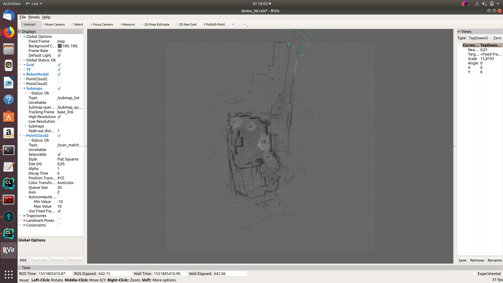

# Google Cartographer
## Table of contents

- [Supported Hardware](#supported-hardware)
- [Setup](#setup)

## Supported Hardware

## Setup

Setup Google Cartographer (these steps are for illustration only, you must adapt these lines to your local directory names)

1. Login to Ubuntu.
2. Open multiple terminals.
3. Terminal 1:
   . ros1_start.sh
   roscore
4. Terminal 2:
  . ros1_start.sh
   cd ~/ros_catkin_ws
   source ./devel/setup.bash
5. Terminal 3:
   roslaunch sick_scan sick_mrs_1xxx_cartographer.launch cloud_topic:=horizontal_laser_3d frame_id:=horizontal_vlp16_link
6. Terminal 4:
   roslaunch sick_scan sick_tim_5xx.launch cloud_topic:=vertical_laser_3d frame_id:=vertical_vlp16_link hostname:=192.168.0.71
7. Terminal 5:

   * . ros1_start.sh
   * cd ~/ros_cartographer_ws
   * source ./install_isolated/setup.bash
   * catkin_make_isolated

   * roslaunch cartographer_ros live_demo_backpack_3d.launch

## Example output

The following figure shows an example of an outdoor slam result using a MRS1104-scanner:

