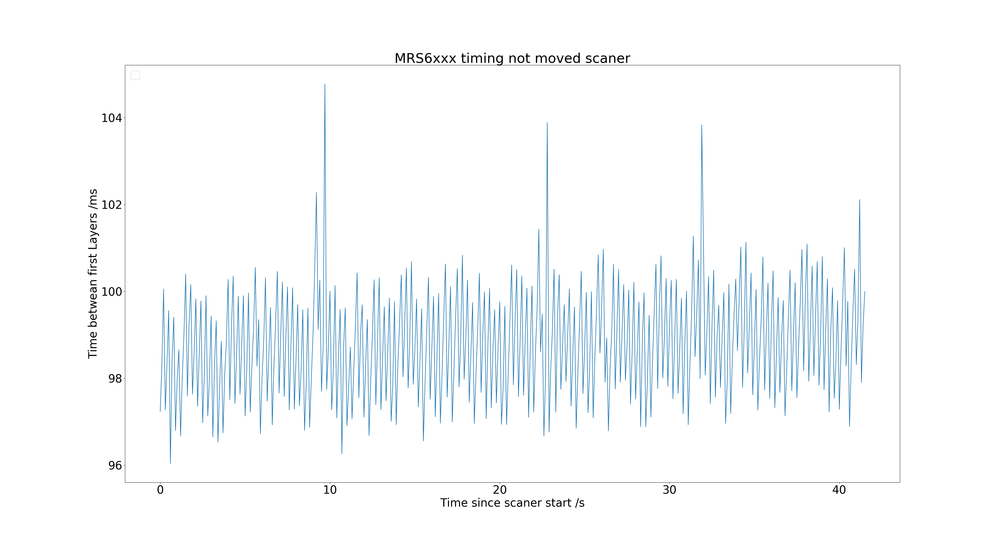
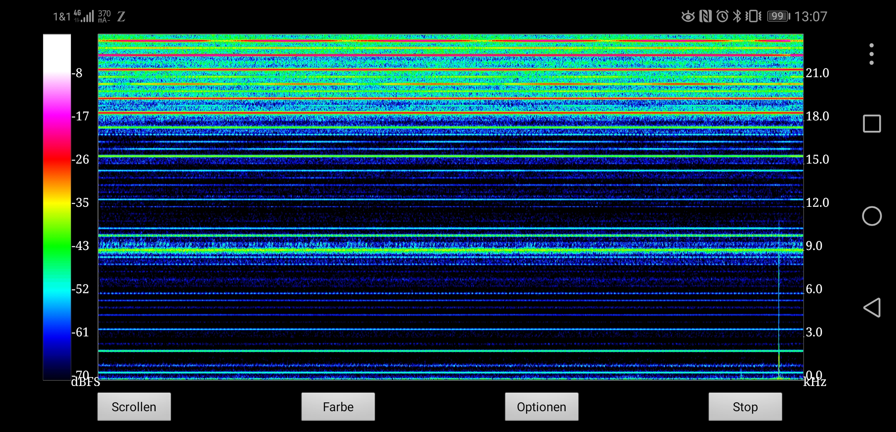

# MRS6xxx Timing
## Timing between Layers
The layers are taken up by the scanner in packs of 6. The scanner delivers at an output data rate of 10 Hz and 24 layers 24/6*10=40 scan packets of 6 layers per second. The following table shows an example of the timing for a complete 24 layer recording

|Raw Time /µs|Delta Time /µs|Elevation Angle /Deg|
|----------|:-------------:|------:|
|2551706348|0|13.19
|2551706348	|0	|12.565
|2551706348	|0	|11.940
|2551706348	|0	|11.315
|2551706348	|0	|10.690
|2551706348	|0	|10.065
|2551731348	|25000	|9.440
|2551731348	|25000	|8.815
|2551731348	|25000	|8.190
|2551731348	|25000	|7.565
|2551731348	|25000	|6.940
|2551731348	|25000	|6.315
|2551756348	|50000	|5.690
|2551756348	|50000	|5.065
|2551756348	|50000	|4.440
|2551756348	|50000	|3.815
|2551756348	|50000	|3.190
|2551756348	|50000	|2.565
|2551781348	|75000	|1.940
|2551781348	|75000	|1.315
|2551781348	|75000	|0.690
|2551781348	|75000	|0.065
|2551781348	|75000	|-0.560
|2551781348	|75000	|-1.185
|NEW SCAN|
|2551807862|	101514|	13.190
|2551807862|	101514|	12.565
|2551807862|	101514|	11.940
|2551807862|	101514|	11.315
|2551807862|	101514|	10.690
|2551807862|	101514|	10.065
|2551832862|	126514|	9.440

## Jitter
The time stamps between the layers are interpolated by the scanner. The time stamps of the first layer (Ang.=13.19°) are measured and show jitter accordingly.
The jitter of the time stamps of the first layer was measured and is shown in the following fig.

In the spectrogram of the sound generated by the scanner, an amplitude modulation appears (e.g. at 6 kHz Band) that roughly matches the fluctuation of the scanning frequencies, compare the following figure.

