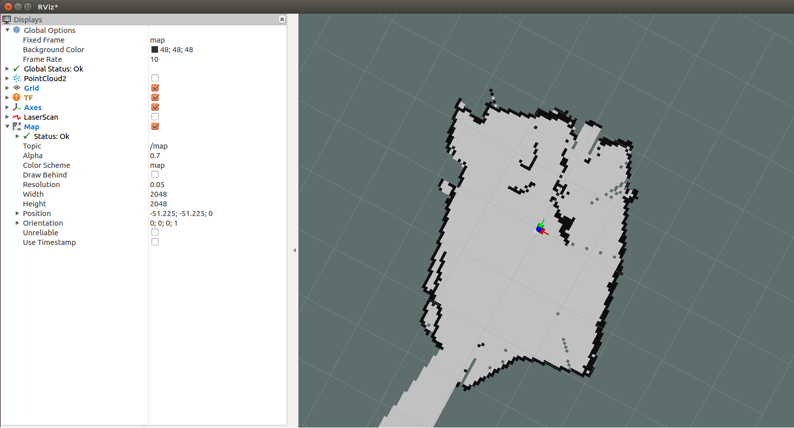

# Slam
## Table of contents

- [Introduction](#introduction)
- [Principle](#measuring-principle)
- [Launch Files](#launch-files)
- [Example Setup](#example-setup)
- [MRS1104 SLAM Support](#MRS1104-SLAM-Support)
- [Google Cartographer](#google-cartographer)

## Introduction

In robotic mapping and navigation, simultaneous localization and mapping (SLAM) is the computational problem of constructing 
or updating a map of an unknown environment while simultaneously keeping track of an agent's location within it. 
For further details please refer to https://en.wikipedia.org/wiki/Simultaneous_localization_and_mapping.

## Measuring Principle

The following assumes that the SLAM algorithm works with a laser scanner mounted on a mobile base. The mobile base (e.g. a robot) records the environment while driving and creates the map from it. The mobile base usually has a so-called intertial measurement unit (IMU). In principle, however, it is also possible to estimate the direction of movement from the chronological sequence of the laser scans by means of correlation observations.
The laser scanner then virtually takes over the task of the IMU and other components (e.g. counting the wheel revolutions). The method of estimating the position and orientation (position estimation) of a mobile system based on data from its driving system is called odometry (cf. https://en.wikipedia.org/wiki/Odometry).

The SLAM algorithm hector_slam (http://wiki.ros.org/hector_slam) supports odometry estimation directly from the laser scans and is therefore used as a reference implementation in the following.

Other widely used SLAM algorithms such as gmapping (cf. http://wiki.ros.org/gmapping ) do not have this option. They depend on the data of an IMU. One possibility to use Gmapping nevertheless is the integration of the project laser_scan_matcher (https://answers.ros.org/question/63457/gmapping-without-odom/ and http://wiki.ros.org/laser_scan_matcher ).  Here, however, the pose must still be converted into an odometry message (see https://answers.ros.org/question/12489/obtaining-nav_msgsodometry-from-a-laser_scan-eg-with-laser_scan_matcher/ ).

## Launch Files

To simplify the start, the launch file test_005_hector.launch is stored in the project. The command
```
roslaunch sick_scan test_005_hector.launch 
```
starts both the laser scanner (MRS1104 type) and the SLAM algorithm. Prerequisite: hector_slam must be installed first.
Please start rviz after the launch.

The image in rviz should look like this:

 

## MRS1104-SLAM-Support

Since Hector-Slam expects only one laser scan frame with a unique identifier for the laser scans, the following parameters were added to the driver.

slam_echo: The name of the echo is entered here, which is filtered out of all possible 12 echoes. This should be "laser_POS_000_DIST1". This exports the first hit in the position with an elevation angle of 0°. If you want to use the layers with elevation angles -2.5°, 2.5° and 5.0°, you can set another flag with the name slam_bundle to True. If this flag is set, the oblique distances are multiplied by the cosine in this direction to obtain the projection onto the XY plane. This quadruples the number of points and increases the scan rate from 12.5 Hz to 50 Hz. However, for oblique impact surfaces (i.e. no vertical walls) this method can lead to larger estimation errors. In this case slam_bundle should be set to false.

## Example Setup

To make SLAM testing even easier, the <catkin_workspace>/src/sick_scan/tools/setup_sick_scan_slam.sh script was created. When you execute this script, a new workspace is created fully automatically, which contains both the sick_scan repo. and the hector_slam repo. The scanner and the SLAM process are then started. rviz is also started to visualize the data.
Start of script:
```
cd <catkin-workspace>/src/sick_scan/tools
. setup_sick_scan_slam.sh 
```

## Google Cartographer


The support of Google Cartographer was made possible by a number of extensions to the driver. On the driver side, the MRS1104 is prepared to support the Google Cartographer. The Google Cartographer expects data packets at a high recording density (several hundred packets per second) to perform the SLAM algorithm. For this reason, an option has been introduced that allows the scans to be chopped into small angular ranges. The time stamps for these small ranges were converted accordingly. You can find results and further information [here](./google_cartographer.md)


