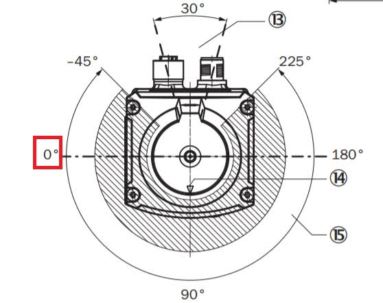
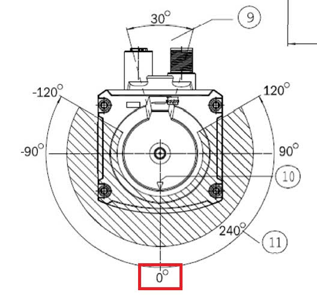

# TiM240
## Table of contents

- [Introduction](#introduction)
- [Scan Area](#scan-area)

## Introduction

The TiM240 is a new scanner that fits seamlessly into the family of other TiM devices. The TiM240 has an opening angle of 240 degrees. In contrast to the previous scanners from SICK, the coordinate system used corresponds directly to the ROS convention. For this reason, this scanner does not require a coordinate conversion of 90 degrees around the Z-axis. However, this is taken into account in the driver code, so that the user will not notice any difference in the setting of the angular ranges during use.
The angular position according to the data sheet can be taken from the drawings below.

## Scan Area

The following figures show the difference between the TiM5xx family and the TiM240 device.
 TiM 5xx scanning area
 TiM 240 scanning area

