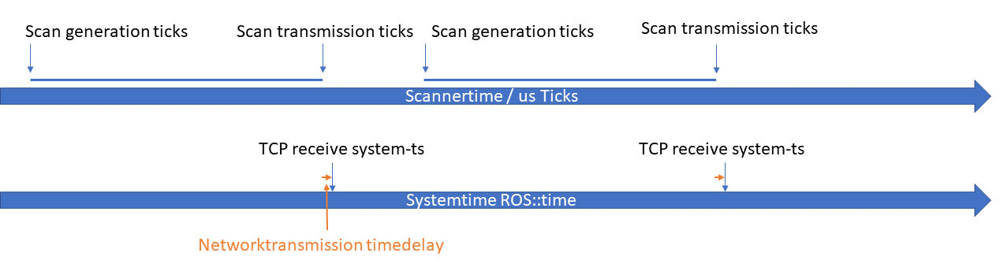
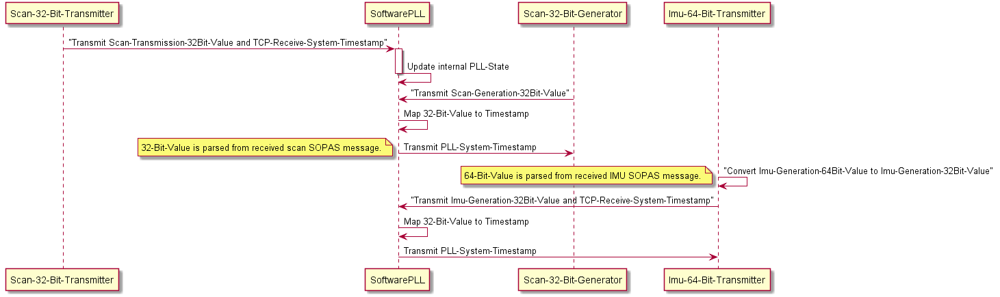
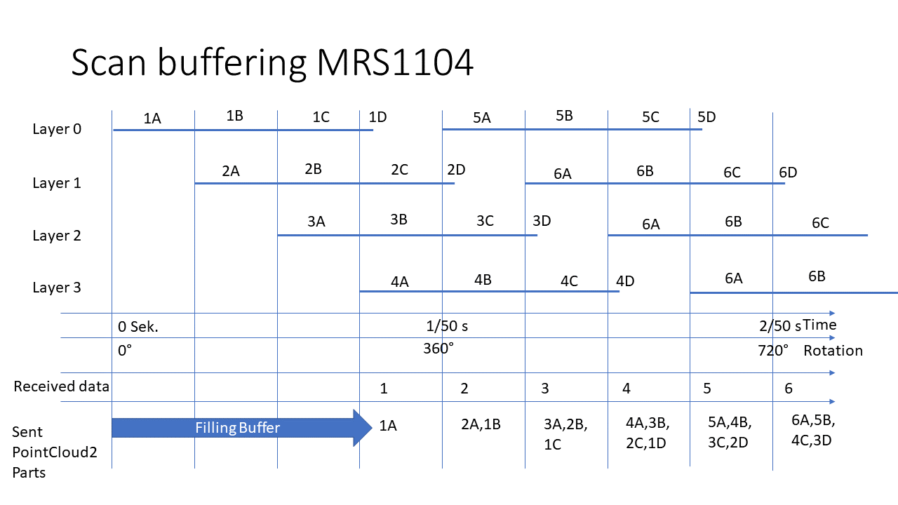

## Time synchronization

Many laser scanner applications require accurate timing down to the level of individual points, so time synchronization is implemented in this ROS driver.
 The scanner has an internal time base of microseconds since system startup. Against this "tick" time base all time stamps are made in the scanner.
 When sending messages from the scanner, two time stamps are added:
1. scan generation ticks--> timestamp at the time of the first shot
2. scan transmission ticks--> time stamp for the transmission of the data

When data packets are received, they are timestamped by the driver against the systemtime in ros::time format. See following Fig.

The relationship between system time and ticks is then derived from the time stamps and kept synchronous.The time required for the transmission of data over the network is assumed to be short and constant and is therefore neglected.
The function of the algorithms is shown in the following Fig.

# Data buffering in MRS 1xxx

Due to their construction the MRS 1xxx scanners generate different layers at the same time which are output sequentially by the scanner firmware. In order to ensure that only point cloud messages that follow one another in time are sent, buffering can be activated in the driver.

